# TrackRep!💪

A light-weight workout tracking app.

## Content

Content

- [Installation](#installation)
  - [iOS and iPadOS](#ios-and-ipados)
  - [Android](#android)
- [Developer Documentation (v0.1)](#developer-documentation-v01)
- [Feature List](#feature-list)
- [Code](#code)
  - [Folder Structure](#folder-structure)
  - [Overview](#overview)
  - [Files](#files)
    - [allExercises.json](#allexercisesjson)
    - [settings.json](#settingsjson)
    - [Create Installer.js](#create-installerjs)
    - [TrackRep!💪.js](#trackrep💪js)
- [Naming Conventions](#naming-conventions)

## Installation

### iOS and iPadOS
1. Download [Scritable](https://scriptable.app/) from the App Store.
2. Click [here](https://github.com/larsleimbach/TrackRep/blob/main/Install%20TrackRep%F0%9F%9B%A0%EF%B8%8F.js) to download the installer.
<div style="display: flex; justify-content: space-between;">
  
  
  
</div>

3. Add to Scriptable library 
<div style="display: flex; justify-content: space-between;">
  
  
  
  
  
</div>
4. Run installation script
<div style="display: flex; justify-content: space-between;">
  
</div>

Tested for iOS/iPad OS 17 and Scriptable 1.7.16.

### Android
Android is currently not supported.

## Developer Documentation (v0.1)
##### Only recommend for developers

## Feature List

- [ ] Visualize progress
- [ ] Workout type selector: max weight or volume workout
- [x] Update funciton
- [ ] Backup funciton
- [ ] Widget Icon
- [ ] Professional workout description pictures
- [ ] Increase the number by two if tapping frequently on + or - (quality of life)
- [ ] Set Emoji as a comment to rate workout
- [ ] Read settings.json once
- [ ] Maybe Android support... maybe
- [x] Track repetition and weight for exercises
- [x] Save to the filesystem as a JSON file
- [x] Add/Delete/Select gyms
- [x] Show the previous workout for one exercise
- [x] Show rekords for one exerices
- [x] Fill out weight and reps from the last set (quality of life feature)
- [x] List exercises by frequency and date
- [x] Bodypart filter function shows already selected body parts
- [x] Performance update: edit table on a representation of the table (rowsOfTable-variable)
  - [x] Change total backend structure
- [x] Hide/Show sets and records
- [x] Add exercises
- [x] Ask once a day in which gym you are training
- [x] All pictures ".JPG"
- [x] Comment out the code + developer docu


## Code


#### Folder Structure

```
root/
├── gym_workout/
│ ├── helper/
│ │ ├── FileOperation.js
│ │ ├── GlobalVars.js
│ │ ├── RowsForTable.js
│ │ ├── Settings.js
│ │ ├── Time.js
│ │ └── Update.js
│ ├── picture/
│ │ └── ...
│ ├── workouts/
│ │ └── ...
│ └── allExercises.json
│ └── settings.json
├── .gitignore
├── README.md
├── Create Installer.js
└── TrackRep!💪.js
```

Here is a dependency graph between the files:

```mermaid
graph TD
  A[RowsForTable.js] --> B[Settings.js]
  A --> C[GlobalVars.js]
  A --> D[FileOperation.js]
  D --> E[Time.js]
  F[Updates.js] --> D
  F --> G[Install TrackRep.js]
  B --> D
  C --> D
  C --> E
  X[TrackRep!💪.js] --> A
  X --> B
  X --> C
  X --> D
```




#### Overview

The whole idea is to use a `UITable`. The `onClick`-function offers 
the tapped row. With this information, giving  
every row its own action is possible. 

Scriptable offers a lot of functions; however, there are limitations, too.
It is impossible to update, insert, or delete rows in a `table`.
Therefore, there is a copy of the table called `rowsOfTable`.
`rowsOfTable` is an array that contains at least the following fields:
```
rowsOfTable: [{row:UITableRow, visible:bool, ...}]
``` 
Each entry of the array corresponds to a row of the table. 
Some entries contain more information. This information is 
used to perform the row action after tapping on it.

With `rowsOfTable`, it is possible to perform the update, insert, and delete
actions. We change only the `rowsOfTable`-array; after this every row 
in the table will be deleted and filled again with the rowsOfTable.

#### Files

##### allExercises.json

To ensure that the state of the app is saved (even after closing it), multiple files are needed.
`allExercises.json` contains all information about an exercise. 
Here is an overview of a workout (which can, for example 
is `2024.07.26 legs.json`) for legs:

```js
{
  "squats":// name of exercise
  {
   "repetitions":42,
   "weight": {
     "unit": "kg", // we want to save the unit
     "amount": 24
   },
   "time": "2024.07.26 15-49-31", // own formatter saved in Time.js
   "type": "maxWeight", // can be volume or other types too
   "gymLocations": "Kraft Station Köln", // gym name
   "comment": ""
  },
  "leg curls": ...
}
```
and an overview of the `allExercises.json`:
```js
{
  "legs":// the key is a bodypart
  {
   "squats"://name of exercise
   {
     "count": 42, // how often this exercise was done
     "expanded": true, // if sets and rekords should be displayed
     "lastWorkout": // the information about the last workout
     {
      // sets of last exercise, see above for definition
     },
     "rekords": // rekords for this exercise are here
     {
      // here types of workout
      "maxWeight":
      {
        "amount": 99, "unit": "kg", "reps":1
      },
      "volume":
      {
        "amount": 1000, "unit": "kg*reps", "reps":1
      },
     }
   },
   ...
  },
  "chest": ...
}
```

Another concept is that `workoutsOfToday` this object contains the 
exercises of today for different bodyparts. These exercises were read 
from the filesystem. 
The location for saved workouts is `gym_workout/workouts/<year>`.

##### settings.json

Next to these files is the `settings.json` to save information that is not about the exercises. For example, when the app was opened the last time.

##### Create Installer.js

Scans the folder and creates an Installer file.

##### TrackRep!💪.js

The main file, which contains the main callback function, that is called 
after tapping on a row.


In summary, the front end is realized by the `UITable` and `rowsOfTable`.
The backend is realized by the `workoutsOfToday` to save the current exercise, and the `allExercises.json` is, for example, used to save if one exercise is expanded.


#### Naming Conventions

- workout: the whole process 
- bodypart: a muscle group, e.g. biceps, legs, ...
- exercise: for example biceps curls, push ups, ...
- repetition: movement from start point to end point and back to start point
- set: a set of repetitions between a pause
- isolated: every arm has its weight
- weight plates: this is a machine with weight plates
- lying: you lay with your back somewhere horizontal to the ground
- incline: upward movement
- decline: downward movement
- cable: cable machines without removable weight plates
- maxWeight: maximum weight
- volume training: reps times weight 

Totally created on an iPad Pro (10.5-inch) with [Scritable](https://scriptable.app/) and [Code](https://github.com/thebaselab/codeapp).

